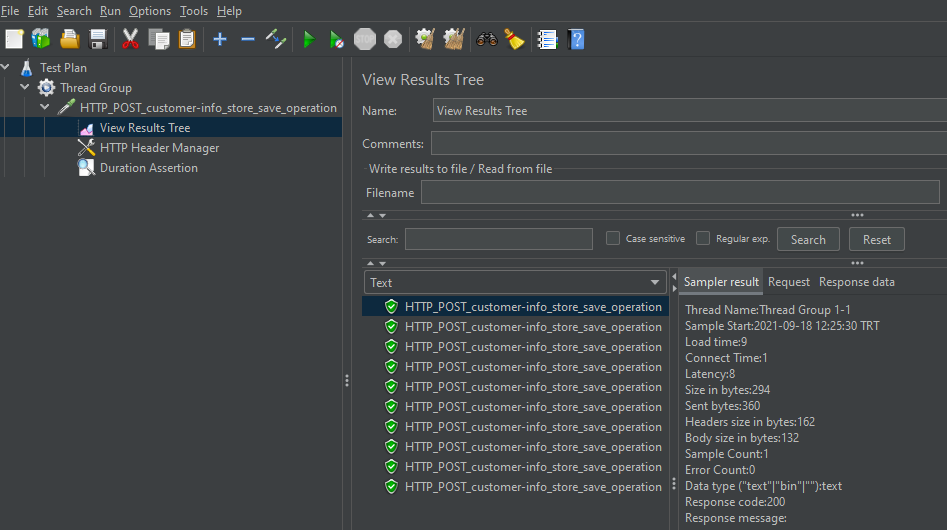
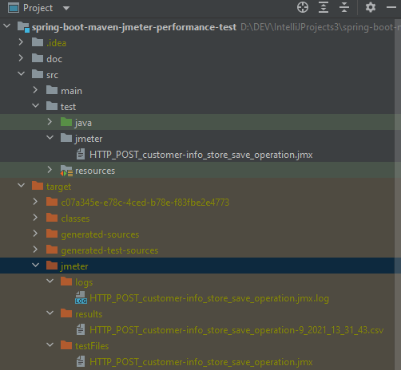

## spring-boot-maven-jmeter-performance-test

Purpose : Create a new maven profile to execute only JMeter performance tests with jmeter-maven-plugin.  
Reason : jmeter-maven-plugin parses and executes all the JMeter Test scripts saved in "src/test/jmeter" directory and generates a performance report in a separate jmeter maven performance execution.  

Steps to follow for preparing JMeter test scripts.  
1- Download apache-jmeter-5.4.1 .  
2- Start JMeter GUI.  
3- Create a new Test Plan and add a new Thread Group with the following values :  
– The number of Threads (users) : 10  
– Ramp-up time : 10  
– Loop count : 1  

4- Add HTTP Request to Thread Group with the following values :  
- protocol : http  
- server name or IP : localhost  
- port number : 8080  
- HTTP Request : POST  
- path : /customer-info/store/save  
- body data :  
  {  
     "name": "jeans_store",  
     "products": [ { "name": "prod1" } ]  
  }  

5- Add View Results Tree to HTTP Request.  
6- Add HTTP Header Manager to HTTP Request with Name/Value as Content-Type=application/json.  
7- Add Duration Assertion to HTTP Request with duration in milliseconds 30 to assert.  
8- Create a performance test and save it as HTTP_POST_customer-info_store_save_operation.jmx file.  
9- Create jmeter directory under src/test folder.  
10- Copy your jmeter HTTP_POST_customer-info_store_save_operation.jmx file & move to src/test/jmeter.  

  

 
### Local run steps  
NOT : Because it is a local test do not forget to start your API before running performance tests. 
1- Start Spring Boot API from main method containing class CustomerInfoApplication.java .  
2- Alternatively you can start your Docker container by following the commands below.  
3- To execute only jmeter performance tests from the console run the following maven command :  
NOT : Execute maven command from where the pom.xml is located in the project directory.  
<pre> 
$ mvn clean install -P performance-test  
</pre>

[INFO] --- jmeter-maven-plugin:3.4.0:results (jmeter-check-results) @ spring-boot-maven-jmeter-performance-test ---  
[INFO]  
[INFO] -------------------------------------------------------  
[INFO] S C A N N I N G    F O R    R E S U L T S  
[INFO] -------------------------------------------------------  
[INFO]  
[INFO] Will scan results using format: CSV  
[INFO]   
[INFO] Parsing results file as type: CSV  
[INFO] Number of failures in 'HTTP_POST_customer-info_store_save_operation-9_2021_13_31_43.csv': 1  
[INFO] Number of successes in 'HTTP_POST_customer-info_store_save_operation-9_2021_13_31_43.csv': 9  
[INFO]   
[INFO] -------------------------------------------------------  
[INFO] P E R F O R M A N C E    T E S T    R E S U L T S  
[INFO] -------------------------------------------------------  
[INFO]   
[INFO] Result (.csv) files scanned: 1  
[INFO] Successful requests:         9  
[INFO] Failed requests:             1  
[INFO] Failures:                    10.0% (2.0% accepted)  
[INFO]  

4- jmeter-maven-plugin results can be accessed from the application directory : "target/jmeter/results"  

  

### Tech Stack
Java 11  
H2 Database Engine  
spring boot  
spring boot starter data jpa  
spring boot starter web  
spring boot starter test  
hibernate  
logback  
maven  
jmeter-maven-plugin  
springfox-swagger-ui  
datasource-proxy  
Docker  
 

### Docker build run steps
NOT : Execute docker commands from where the DockerFile is located.  
<pre>
$ docker system prune  
$ docker build . --tag demo   
$ docker run -p 8080:8080 -e "SPRING_PROFILES_ACTIVE=dev" demo:latest  
</pre>

## API OPERATIONS
### Save store with products successfully to database

Method : HTTP.POST  
URL : http://localhost:8080/customer-info/store/save  

Request : 
<pre>
curl --location --request POST 'http://localhost:8080/customer-info/store/save' \
--header 'Content-Type: application/json' \
--data-raw '{
  "name": "jeans_store",
  "products": [
    {
      "name": "prod1"
    },
    {
      "name": "prod2"
    },
    {
      "name": "prod3"
    }
  ]
}'
</pre> 

Response : 

HTTP response code 200  
<pre>
{
    "id": 1,
    "name": "jeans_store",
    "products": [
        {
            "id": 1,
            "name": "prod3"
        },
        {
            "id": 2,
            "name": "prod1"
        },
        {
            "id": 3,
            "name": "prod2"
        }
    ]
}
</pre>

### List Store saved to database

Method : HTTP.GET  
URL : http://localhost:8080/customer-info/store/list  

Request : 
<pre>
curl --location --request GET 'http://localhost:8080/customer-info/store/list'
</pre> 

Response : 

HTTP response code 200  
<pre>
[
    {
        "id": 1,
        "name": "jeans_store",
        "products": [
            {
                "id": 1,
                "name": "prod3"
            },
            {
                "id": 2,
                "name": "prod1"
            },
            {
                "id": 3,
                "name": "prod2"
            }
        ]
    }
]
</pre> 
